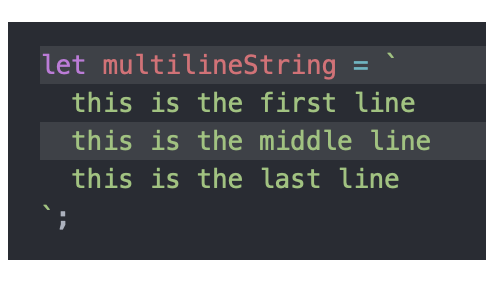
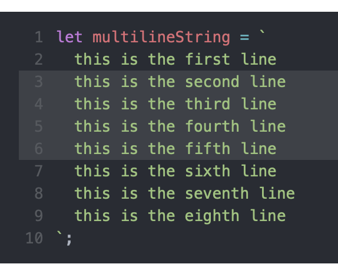
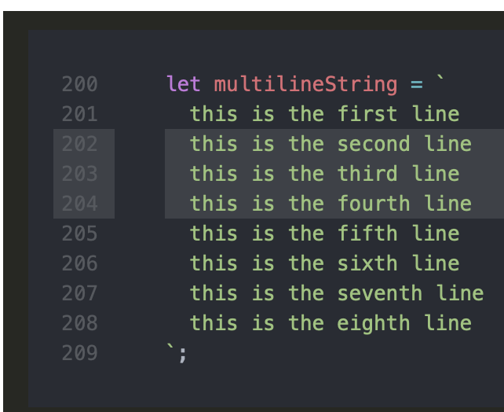

<p align="center"></p>

# eleventy-plugin-syntaxhighlighting-chroma

**WIP WIP WIP WIP WIP WIP**

A module for handling syntax highlighting in [Eleventy](https://github.com/11ty/eleventy) using [Chroma](https://github.com/alecthomas/chroma); a syntax highlighter written in Go. There is no browser/client JavaScript required, the highlight transformations are all done at build-time.

I am making using of the [chroma-highlight](https://github.com/krymel/chroma-highlight) NPM package to include `Chroma` support. (It handles downloading the required binary for the platform you are working on).

This module/plugin took the 11ty plugin [eleventy-plugin-syntaxhighlight](https://github.com/11ty/eleventy-plugin-syntaxhighlight) as the basis.

## Supported args in code blocks

The first argument is always expected to be the language, at present there is no bugout/fail if a language is not provided first. (Nor in the original plugin)

For Markdown, separate arguments with a `/`, this seems to be hard coded somewhere and I haven't a workaround yet. For `liquid` and `njk` use spaces (` `) to separate arguments.

Arguments:

- `lineNumbers` will add line numbers starting from 1 for each code block.
- `lineNumbersStyle` if `table` is used, then code block will use a table to make it easier to drag and select the code. i.e `lineNumberStyle=table`
- `lineNumbersStart` the number to start the line number count from. i.e `lineNumbersStart=200`
- number **or** number, number **or** number,rangeStartNumber-rangeEndNumber **or** number,rangeStartNumber-rangeEndNumber to specify a line or lines to highlight. i.e `1`, or `1,3`, or `3:6`, or `1,3:6`, or `2,4-6`. **NOTE** if you specify `lineNumbersStart` then the specified numbers must be relative to that (so `lineNumbersStart=200`, then use `204` to highlight line 204)

## Supported `options` in eleventy config

You can specify some arguments in the options object in `.eleventy.js` config. ~~Options are considered defaults, and can be overriden by codeblock arguments.~~**TODO**

Example of `options` object

```
options
{
  theme: 'onedark',
  lineNumbers: false,
}
```

Theme can be set to one of these [themes](https://xyproto.github.io/splash/docs/all.html). If no theme is specified, then `xcode-dark` is used.

- `lineNumbers` will add line numbers starting from 1 for each code block.
- `lineNumbersStyle` if `table` is used, then code block will use a table to make it easier to drag and select the code.

## TO DO

- [✅] Support `.liquid` files
- [] Add passed in `code` and `pre` atributes into returned html from chroma
- [] Add testing
- [] Add improve regex for line numbers
- [] Add other arguments that chroma can take (`--html-tab-width`, `--html-highlight-style`, maybe `--html-linkable-lines`)

## Example output

Highlight line 1 and 3

````
```js/1,3
let multilineString = `
  this is the first line
  this is the middle line
  this is the last line
`;
```
````



Line numbers shown and highlighting range of lines 3 through 6

````
```js/3:6/lineNumbers
let multilineString = `
  this is the first line
  this is the second line
  this is the third line
  this is the fourth line
  this is the fifth line
  this is the sixth line
  this is the seventh line
  this is the eighth line
`;
```
````



Line numbers shown, line numbers set to start at 200, and highlighting range of lines 202 through 204

````
```js/202:204/lineNumbers/table/lineNumbersStart=200
let multilineString = `
  this is the first line
  this is the second line
  this is the third line
  this is the fourth line
  this is the fifth line
  this is the sixth line
  this is the seventh line
  this is the eighth line
`;
```
````

